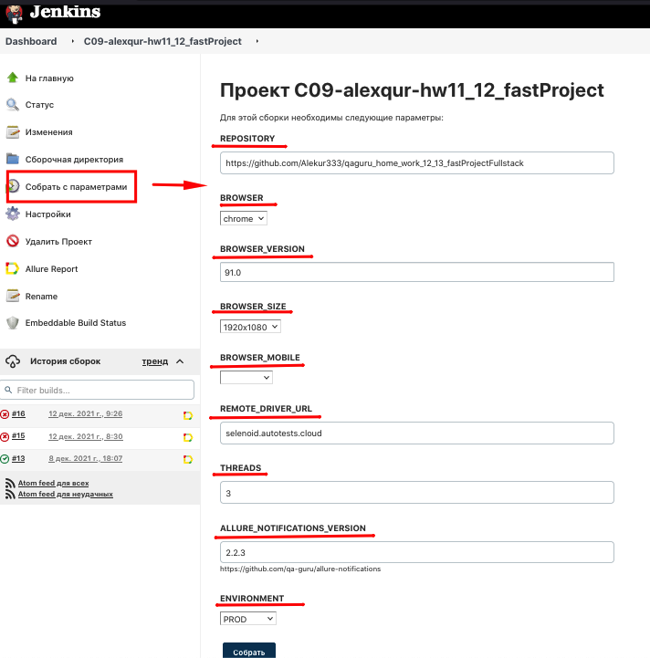
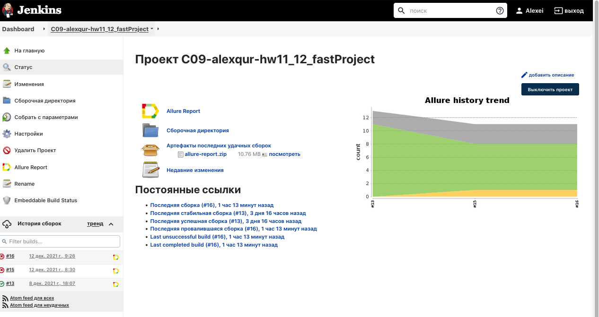
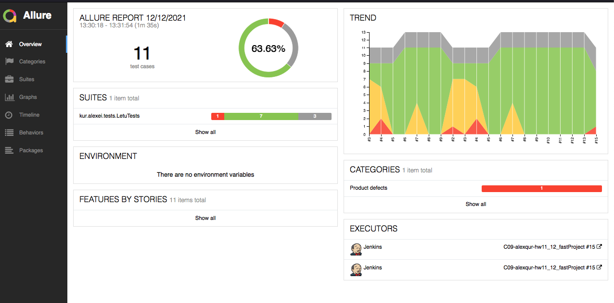
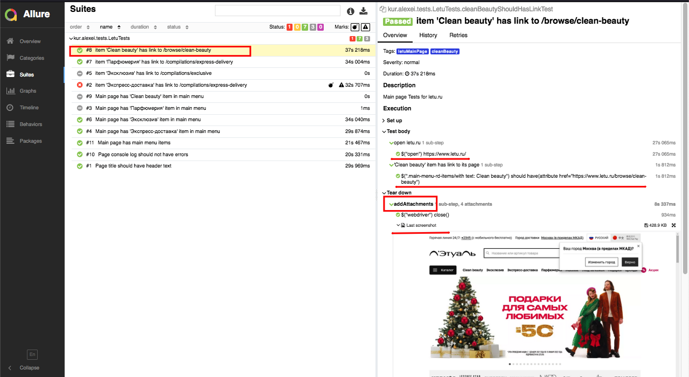
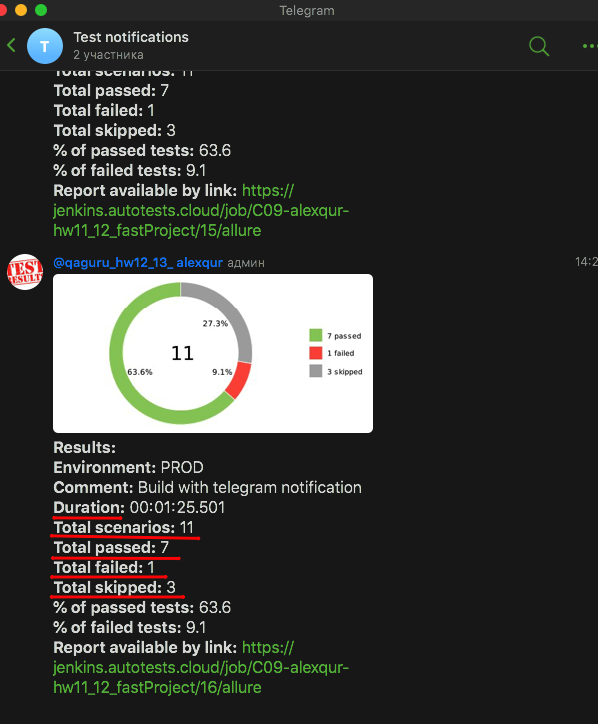

# Here are a number of automated tests of main page [Л'Этуаль](https://www.letu.ru/)

##Used tools and libraries

<p  align="left">
<code>


</code>
</p>


# USAGE examples

### For run remote tests need fill remote.properties or to pass value:

* browser (default chrome)
* browserVersion (default 89.0)
* browserSize (default 1920x1080)
* browserMobileView (mobile device name, for example iPhone X)
* remoteDriverUrl (url address from selenoid or grid)
* videoStorage (url address where you should get video)
* threads (number of threads)


Run tests with filled remote.properties:
```bash
gradle clean test
```

Run tests with not filled remote.properties:
```bash
gradle clean 
-DremoteDriverUrl=https://%s:%s@selenoid.autotests.cloud/wd/hub/ 
-DvideoStorage=https://selenoid.autotests.cloud/video/ 
-Dthreads=1 
test
```

Serve report:
```bash
allure serve build/allure-results
```

###### For further development there are some example tests in [src/test/java/kur/alexei/tests](https://github.com/Alekur333/qaguru_home_work_12_13_fastProjectFullstack/blob/main/src/test/java/kur/alexei/tests/LetuTests.java)
* remove @Disabled("...") annotation to run desabled tests
```bash
gradle clean letuMainPageTest // to run all tests of main page
```
```bash
gradle clean letuParfumeTest // to run tests with tag "parfyumeriya"
```

# Jenkins

## Jenkins parameters

<p  align="left">
<code>

</code>
</p>

## Jenkins job

<p  align="left">
<code>

</code>
</p>

# Allure Report

## Allure overview
<p  align="left">
<code>

</code>
</p>

## Allure test result
<p  align="left">
<code>

</code>
</p>

## Allure video result
<p  align="left">
<code>

</code>
</p>

# Telegram notification
<p  align="left">
<code>

</code>
</p>


:heart: <a target="_blank" href="https://www.linkedin.com/in/alexei-kurochkin-5693a01a2/">My linkedIn profile</a><br/>
